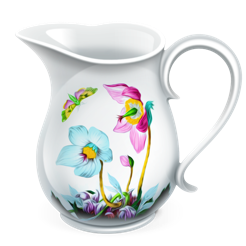

### Hi there 👋 Wellcome to my GitHub :relaxed:	

:heavy_check_mark: *Currently I'm looking for work as **QA automation engineer**. I like to be involved in all stages of software development and provide customers with a quality product!*

<h2> My projects </h2>

  in progress

  

  <h2>Languages and tools which I use in my work</h2>
 

  <code></code>
  <code></code>
  <code></code>
  <code></code>
  <code></code>
  
  <code></code>
  <code></code>
  <code></code>
  <code></code>
  <code></code>
  
  <code></code>
  <code></code>
  <code></code>
  <code></code>
  <code></code>
  
  <code></code>
  <code></code>
  <code></code>
  <code></code>
  <code></code>

  

<h2>Contacts</h2>

 

 

